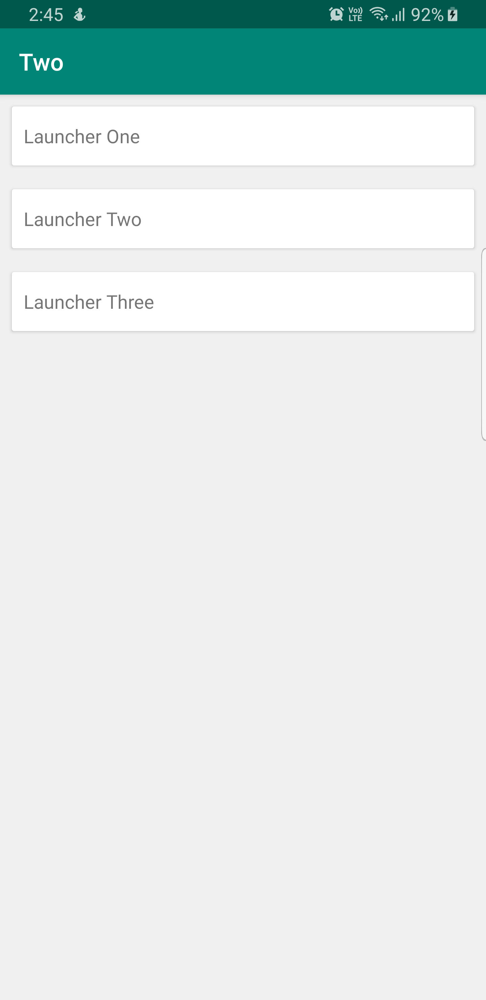
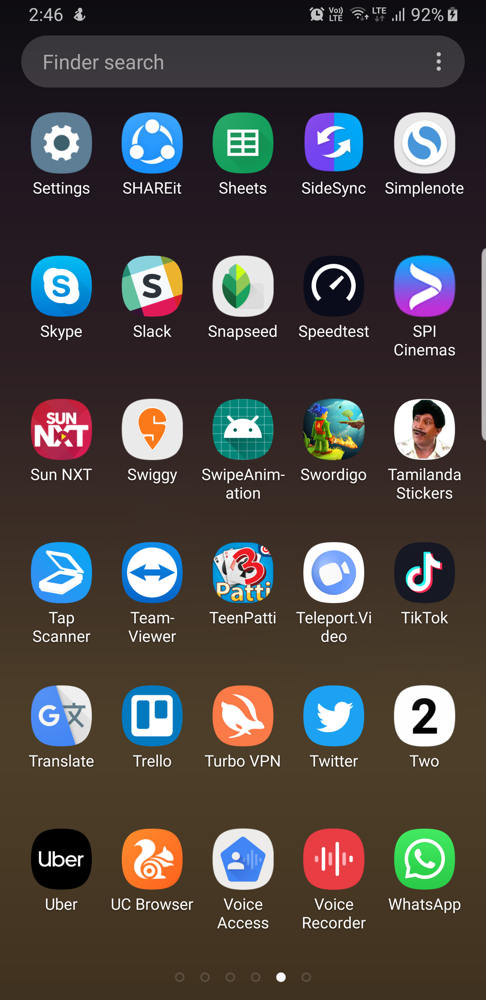

# Dynamic Launcher Icon and Name

Sample project for changing the app icon and app name dynamically. 

<br>
**Note that the gradle build files are written in Kotlin**
<br>

**Steps** <br>
*Step 1* <br>Create empty class each for the number of icons wanted to declear. In my example, it is OneLauncherAlias.kt, TwoLauncherAlias.kt and ThreeLauncherAlias.kt

```
package com.misles.dynamiclaunchericon

class OneLauncherAlias {
    // No bocdimplementation required for this setup.
}
```

*Step 2* <br>

Add Activity alias in your **AndroidManifest.xml**

```
<activity-alias
                android:name="OneLauncherAlias"
                android:enabled="true"
                android:icon="@drawable/one"
                android:label="One"
                android:targetActivity=".MainActivity">
            <intent-filter>
                <action android:name="android.intent.action.MAIN"/>
                <category android:name="android.intent.category.LAUNCHER"/>
            </intent-filter>
        </activity-alias>

        <activity-alias
                android:name="TwoLauncherAlias"
                android:enabled="false"
                android:label="Two"
                android:icon="@drawable/two"
                android:targetActivity=".MainActivity">
            <intent-filter>
                <action android:name="android.intent.action.MAIN"/>
                <category android:name="android.intent.category.LAUNCHER"/>
            </intent-filter>
        </activity-alias>

        <activity-alias
                android:name="ThreeLauncherAlias"
                android:enabled="false"
                android:label="Three"
                android:icon="@drawable/three"
                android:targetActivity=".MainActivity">
            <intent-filter>
                <action android:name="android.intent.action.MAIN"/>
                <category android:name="android.intent.category.LAUNCHER"/>
            </intent-filter>
        </activity-alias>
        
 ```
 
 *Step 3* <br>
  Enable and disable the activity-alias based on your requirment. In my example, On click of the one layout, i am enabling the activity-alias OneLauncherAlias and disabling the rest.
  
```
one.setOnClickListener{
            packageManager.setComponentEnabledSetting(ComponentName(this@MainActivity, com.misles.dynamiclaunchericon.OneLauncherAlias::class.java), PackageManager.COMPONENT_ENABLED_STATE_ENABLED,PackageManager.DONT_KILL_APP)
            packageManager.setComponentEnabledSetting(ComponentName(this@MainActivity, com.misles.dynamiclaunchericon.TwoLauncherAlias::class.java), PackageManager.COMPONENT_ENABLED_STATE_DISABLED,PackageManager.DONT_KILL_APP)
            packageManager.setComponentEnabledSetting(ComponentName(this@MainActivity, com.misles.dynamiclaunchericon.ThreeLauncherAlias::class.java), PackageManager.COMPONENT_ENABLED_STATE_DISABLED,PackageManager.DONT_KILL_APP)

            Toast.makeText(this@MainActivity, "Launcher one has been applied successfully",Toast.LENGTH_SHORT).show()
        }

        two.setOnClickListener{
            packageManager.setComponentEnabledSetting(ComponentName(this@MainActivity, com.misles.dynamiclaunchericon.OneLauncherAlias::class.java), PackageManager.COMPONENT_ENABLED_STATE_DISABLED,PackageManager.DONT_KILL_APP)
            packageManager.setComponentEnabledSetting(ComponentName(this@MainActivity, com.misles.dynamiclaunchericon.TwoLauncherAlias::class.java), PackageManager.COMPONENT_ENABLED_STATE_ENABLED,PackageManager.DONT_KILL_APP)
            packageManager.setComponentEnabledSetting(ComponentName(this@MainActivity, com.misles.dynamiclaunchericon.ThreeLauncherAlias::class.java), PackageManager.COMPONENT_ENABLED_STATE_DISABLED,PackageManager.DONT_KILL_APP)
            Toast.makeText(this@MainActivity, "Launcher three has been applied successfully",Toast.LENGTH_SHORT).show()
        }

        three.setOnClickListener{
            packageManager.setComponentEnabledSetting(ComponentName(this@MainActivity, com.misles.dynamiclaunchericon.OneLauncherAlias::class.java), PackageManager.COMPONENT_ENABLED_STATE_DISABLED,PackageManager.DONT_KILL_APP)
            packageManager.setComponentEnabledSetting(ComponentName(this@MainActivity, com.misles.dynamiclaunchericon.TwoLauncherAlias::class.java), PackageManager.COMPONENT_ENABLED_STATE_DISABLED,PackageManager.DONT_KILL_APP)
            packageManager.setComponentEnabledSetting(ComponentName(this@MainActivity, com.misles.dynamiclaunchericon.ThreeLauncherAlias::class.java), PackageManager.COMPONENT_ENABLED_STATE_ENABLED,PackageManager.DONT_KILL_APP)
            Toast.makeText(this@MainActivity, "Launcher two has been applied successfully",Toast.LENGTH_SHORT).show()
        }
```

#Screenshots 
<br>
       
